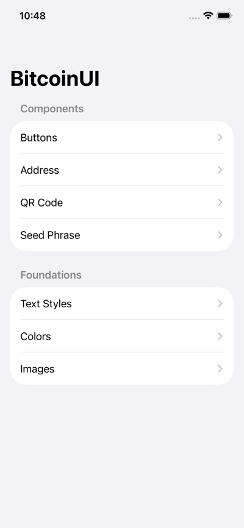
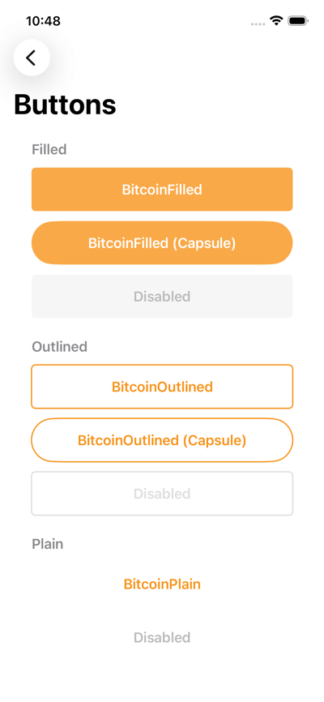
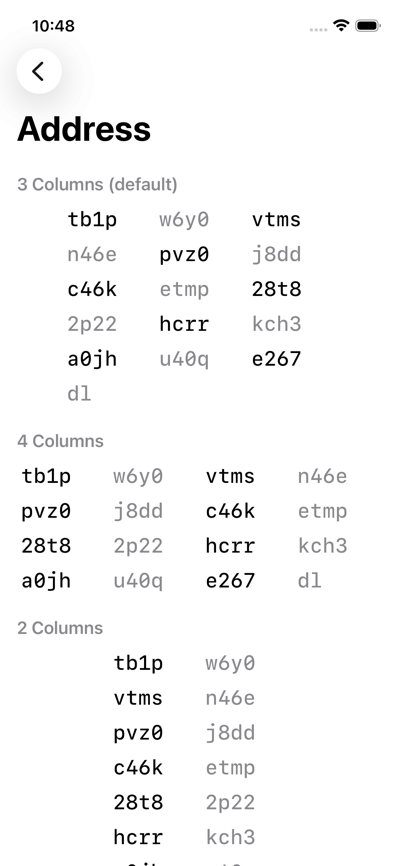
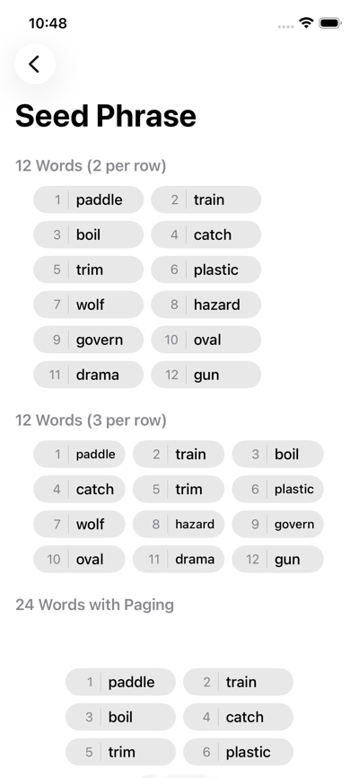
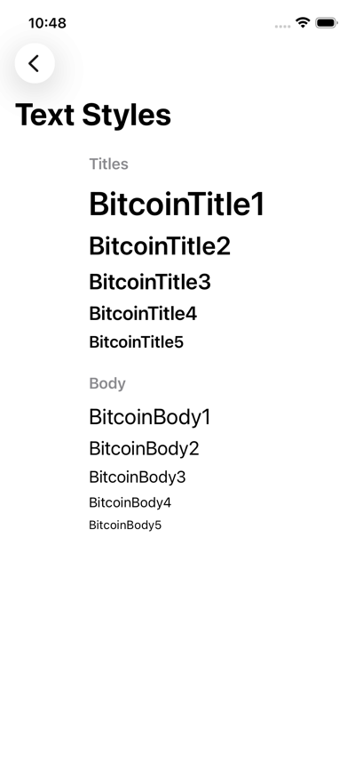
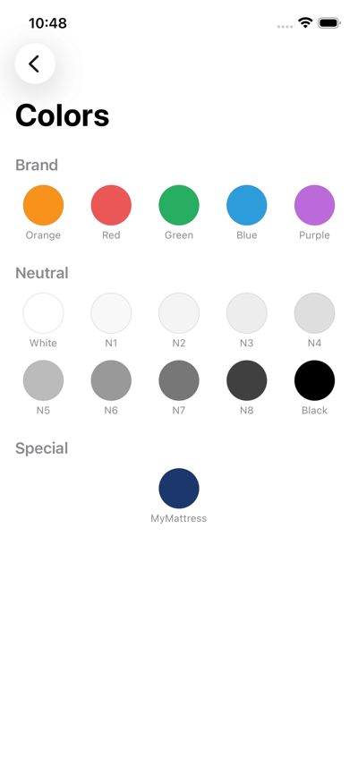
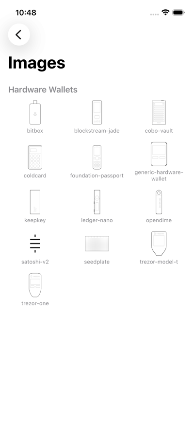

# Bitcoin UI

Bitcoin UI components and review for native iOS apps.

[Swift Package](#swift-package)<br>
[Demo App](#demo-app)<br>
[Design Review](#design-review)<br>

## Swift Package

Install `BitcoinUI` via Swift Package Manager with `https://github.com/reez/BitcoinUI`

`BitcoinUI` includes:

- Colors  
- Button styles
- Text styles
- Icons
- Views

Example usage:

```swift
import BitcoinUI

Text("Bitcoin Orange")
    .font(.caption)
    .foregroundColor(.bitcoinOrange)
    .multilineTextAlignment(.center)
```

## Demo App

Open `Demo.swiftpm/Demo.xcodeproj` in Xcode, select an iOS Simulator, and press Run (⌘R).



## Design Review

Install `bitcoinui` in your AI coding tool.

### [Claude](https://code.claude.com/docs/en/slash-commands)

```sh
curl -fsSL https://bitcoinui.ai/install.sh | bash
claude
/bitcoinui
```

### [Codex](https://github.com/openai/codex/blob/main/docs/skills.md)

```sh
curl -fsSL https://bitcoinui.ai/install.sh | bash
codex
$bitcoinui
```

### [Cursor](https://cursor.com/docs/agent/chat/commands)

```sh
curl -fsSL https://bitcoinui.ai/install.sh | bash
cursor
/bitcoinui
```

### [OpenCode](https://opencode.ai/docs/commands/)

```sh
curl -fsSL https://bitcoinui.ai/install.sh | bash
opencode
/bitcoinui
```

Example output:

```
BITCOINUI

SendFeeView.swift
Findings: 0 high, 2 medium, 0 low

Medium
1) [UX L88] Fee picker lacks a high-fee warning
   Fix: Add a warning when fee >= 50% of amount.
   Ref: Bitcoin Design Guide — Send fees https://bitcoin.design/guide/daily-spending-wallet/sending/send-fees/
2) [A11Y L42] Icon-only close button has no label
   Fix: Add accessibilityLabel("Close")
   Ref: iOS HIG — Accessibility https://developer.apple.com/design/human-interface-guidelines/accessibility
```
